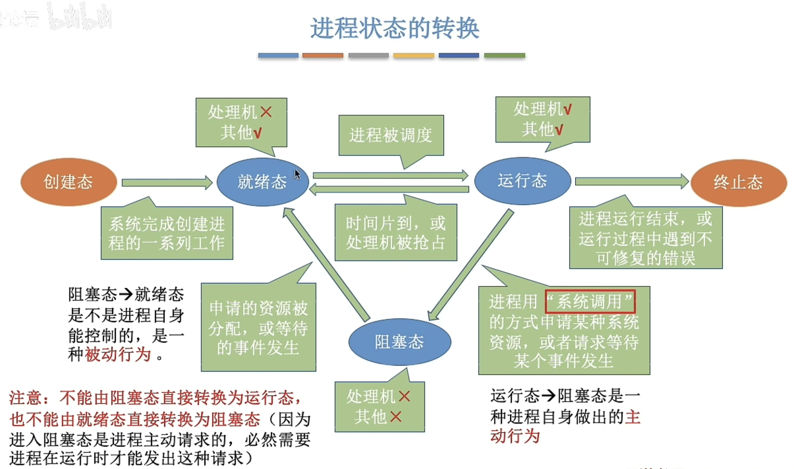
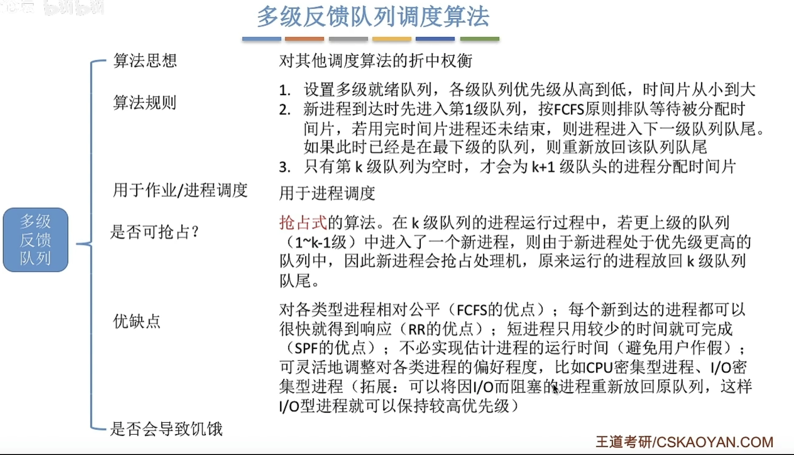

# 操作系统期中复习

## 信号量

```c++
typedef struct{
  int value;
  struct process *L;
}semaphore;

semaphore mutex=1;//初始化信号量
p1()
{
  P(mutex);//使用临界资源前需要加锁
  
  V（mutex）;//使用临界区资源后需要解锁
  
}

p2()
{
  P(mutex);//使用临界资源前需要加锁
  
  V（mutex）;//使用临界区资源后需要解锁
  
}
```

保证一前一后需要在前操作之后执行V（S），后操作之前执行P（S）。前V后P  P--  V++


## 生产者消费者问题

```c++
semaphore mutex=1;//互斥信号量
semaphore empty=n;//空闲缓冲区的数量 同步信号量
semaphore full=0;//非空缓冲区的数量 同步信号量

producer(){
  while(1){
    //生产一个产品；
    P(empty);//消耗一个空闲缓冲区
    P(mutex);
    //把产品放入缓冲区
    V(mutex);
    V(full);//增加一个产品
  }
}

consumer(){
  while(1){
    P(full);
    P(mutex);
    //从缓冲区取出一个产品
    V(mutex);
    V(empty);
    //使用产品
  }
}
  
```

P操作不能颠倒，若empty=0，full=n，颠倒则会出现死锁现象


## 读写者问题

```c++
semaphore rw=1;//共享文件互斥访问
int count=0;//记录有几个进程在读文件
semaphore mutex=1;//保证对count变量的互斥访问
semaphore w=1;//保证实现写优先

writer(){
  while(1){
    P(w);
    P(rw);
    //写文件；
    V(rw);
    V(w);
  }
}

reader(){
  while(1){
    P(w);
    P(mutex);
    if(count==0){
      P(rw);
    }
    count++;
    V(mutex);
    V(w);
    //读文件
    P(mutex);
    count--;
    if(count==0){
      V(rw);
    }
    V(mutex);
  }
}

```


## 哲学家进餐问题

```c++
semaphore chopstick[5]={1,1,1,1,1};
semaphore mutex=1;
pi(){
  while(1){
    P(mutex);
    P(chopstick[i]);
    P(chopstick[i+1%5]);
    V(mutex);
    //进餐；
    V(chopstick[i]);
    V(chopstick[i+1%5]);
    //思考；
  }
}
```


## 管程

基本特征：各外部进程/线程只能通过管程提供的特定入口才能访问共享数据。每次仅允许一个进程在管程内执行某个内部过程 

## 系统调用

操作系统提供给应用程序的一套接口

作用：安全和屏蔽细节

系统调用的过程：传递系统调用参数->执行陷入指令（用户态）->执行相应的内请求核程序处理系统调用态（核心态）->返回应用程序

**大内核**：性能高但内核代码庞大，结构混乱，难易维护

**微内核**：内核功能少，结构清晰，方便维护，但需要频繁的在核心态和用户态之间切换，性能低

## 操作系统引导（开机过程）


## 虚拟机（VMM）

第一类VMM：直接运行在硬件上

第二类VMM：运行在宿主操作系统上


# 进程

## 进程控制块（PCB）

操作系统对进程进行管理工作所需的信息都在PCB中。

一个进程实体由PCB、程序段、数据段组成。

PCB是进程存在的唯一标识。

## 进程的状态

**创建态**  **就绪态**  **运行态**  **阻塞态**：请求等待某个事件发生  **终止态**





 ## 进程控制

原语的执行具有原子性，执行过程一气呵成

## 进程通信

**共享存储**：低级通信：基于数据结构的共享；高级通信：基于存储区的共享  

**消息传递**：直接通信方式/间接通信方式（信箱通信方式）

**管道通信**：管道就是在内存中开辟一个大小固定的内存缓冲区，以队列方式读写。一个管道只能单向，两个管道双向

# 线程

**用户级线程**：线程管理工作都由用户程序负责。线程切换在用户状态下即可完成。

优点：在用户空间即可完成，不需要切换到核心态，线程管理系统开销小，效率高。

缺点：当一个用户级线程被阻塞后，整个进程都会被阻塞。多个线程不可在多核处理机上运行。

**内核级线程**：线程管理工作由操作系统内核完成。线程切换必须在核心态下完成。

优点：一个线程被阻塞后，别的线程还可以继续执行。

缺点：一个用户进程要占用多个内核级线程，线程切换由操作系统内核完成，需要切换到核心态，因此成本高，开销大。

**多线程模型**：一对一模型  多对一模型  多对多模型

用户级线程 线程库 内核级线程 进程

## 线程的状态与转换

线程控制块TCB

# 调度

**进程调度的方式**：非抢占方式，抢占式

**进程切换**：对原来运行进程各种数据的保存，对新的进程各种数据的恢复

## 调度算法

CPU利用率：忙碌的时间/总时间

系统吞吐量：总共完成了多少道作业/总共花了多少时间

周转时间：作业完成时间-作业提交时间

平均周转时间：各作业周转时间之和/作业数

带权周转时间：周转时间/运行时间

等待时间：等待处理机状态时间之和

### 先来先服务（FCFS）

非抢占式算法

优点：公平、算法实现简单

缺点：对长作业有利，对短作业不利

不会饥饿

### 短作业优先（SJF）

每次选择当前已到达且运行时间最短的作业/进程

非抢占式算法

#### 最短剩余时间优先算法（SRTN）

每当有进程加入就绪队列改变时就需要调度，如果新到达的进程剩余时间比当前运行进程的剩余时间短，则新进程抢占处理机，当前运行进程重回就绪队列

优点：最短的平均等待时间、平均周转时间

缺点：对短作业有利，对长作业不利，可能会产生饥饿现象

### 高响应比优先（HRRN）

响应比=（等待时间+要求服务时间）/要求服务时间

不会导致饥饿

### 时间片轮转调度算法（RR）

按照各进程到达就绪队列的顺序，轮流让各进程执行一个时间片。若进程未在一个时间片内执行完，则剥夺处理机并添加到就绪队列末尾。

抢占式算法

优点：公平，响应快，适用于分时操作系统

缺点：进程切换有一定开销

### 优先级调度算法

按照优先级顺序调度

### 多级反馈队列调度算法




会导致饥饿


## 小知识点

进程：操作系统中资源分配和独立运行的基本单位，包含程序代码、数据、进程控制快（PCB）等，是动态执行的实体

管程：一种同步机制，是包含共享数据和操作这些数据的过程的集合，用于解决进程间同步互斥问题，通过封装实现对共享资源的安全访问

多级反馈队列调度：一种进程调度算法，设置多个优先级队列，进程按规则在队列间迁移，高级队列时间片短，综合了短作业优先、时间片轮转的特点

互斥量用于线程的互斥，信号量用于线程的同步

互斥：某一资源同时只允许一个访问者对其进行访问，具有唯一性和排他性。但互斥无法限制访问者对资源的访问顺序，即访问是无序的。

同步：在互斥的基础上，通过其他机制实现访问者对资源的有序访问

互斥量只能为0/1，信号量值可以是非负整数

互斥量的加锁解锁必须由同一线程分别对应使用，信号量可以由一个线程释放，另一个线程得到

死锁：多个进程循环等待对方，都无法执行

饥饿：某个或某些进程由于无法得到资源长时间无法执行

核心态：操作系统内核受保护的状态

用户态：用户进程执行所在的状态

处于用户态只能访问进程的地址空间，用户态需要通过中断或系统调用才能进入核心态

对于单线程的进程，进程既是资源管理的单位，也是任务调度的单位

对于多线程的进程，线程是任务调度单位，进程是资源管理单位

线程相关的硬件资源包括：CPU的寄存器以及栈

进程相关的资源包括：除栈外的其它内存，打开文件列表

并发：一个时间间隔内有多个任务在执行（宏观上）

并行：同一时刻内有多个任务在执行（微观上）

多对称处理系统：每个处理器独立做出调度决策

非对称多处理系统：仅由一个处理器访问系统数据结构，从而减少数据共享的需求

微内核：操作系统内核只包含最基本的功能（进程调度和进程间通信）

模块化内核：操作系统内核的一些功能可以作为模块挂载

长程调度：操作系统决定到底有多少进程能够从new状态进入就绪状态的调度

中程调度：操作系统决定哪些进程的地址空间能够保留在内存中，哪些需要被交换到外存的调度


